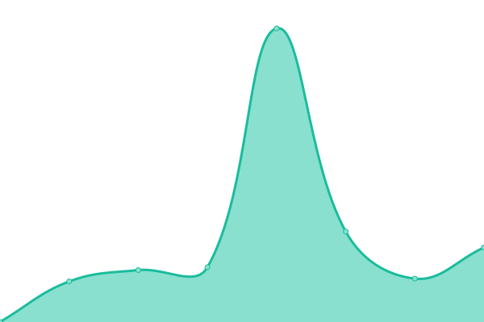

# [📈 Live Status](https://status.iscccc.eu.org): <!--live status--> **🟧 Partial outage**

This repository contains the open-source uptime monitor and status page for [Cccc\_](https://blog.iscccc.eu.org/), powered by [Upptime](https://github.com/upptime/upptime).

With [Upptime](https://upptime.js.org), you can get your own unlimited and free uptime monitor and status page, powered entirely by a GitHub repository. We use [Issues](https://github.com/Cccc-owo/upptime/issues) as incident reports, [Actions](https://github.com/Cccc-owo/upptime/actions) as uptime monitors, and [Pages](https://status.iscccc.eu.org) for the status page.

<!--start: status pages-->
<!-- This summary is generated by Upptime (https://github.com/upptime/upptime) -->
<!-- Do not edit this manually, your changes will be overwritten -->
<!-- prettier-ignore -->
| URL | Status | History | Response Time | Uptime |
| --- | ------ | ------- | ------------- | ------ |
|  [我的博客 -My Blog](https://blog.iscccc.eu.org) | Up | [my-blog.yml](https://github.com/Cccc-owo/upptime/commits/HEAD/history/my-blog.yml) | 

 393ms
     
 | 

<a href="https://status.iscccc.eu.org/history/my-blog">100.00%</a>
    

|  [欧陆风云四百科（eu4cn）](https://www.eu4cn.com) | Down | [eu4cn.yml](https://github.com/Cccc-owo/upptime/commits/HEAD/history/eu4cn.yml) | 

 8835ms
     
 | 

<a href="https://status.iscccc.eu.org/history/eu4cn">94.06%</a>
    

|  [ParaTranz](https://paratranz.cn/) | Up | [para-tranz.yml](https://github.com/Cccc-owo/upptime/commits/HEAD/history/para-tranz.yml) | 

 1097ms
     
 | 

<a href="https://status.iscccc.eu.org/history/para-tranz">92.27%</a>
    

|  [52pcgame](http://52pcgame.net/) | Up | [52pcgame.yml](https://github.com/Cccc-owo/upptime/commits/HEAD/history/52pcgame.yml) | 

 1862ms
     
 | 

<a href="https://status.iscccc.eu.org/history/52pcgame">100.00%</a>
    

<!--end: status pages-->

[**Visit our status website →**](https://status.iscccc.eu.org)

## 📄 License

- Powered by: [Upptime](https://github.com/upptime/upptime)
- Code: [MIT](./LICENSE) © [Anand Chowdhary](https://anandchowdhary.com), supported by [Pabio](https://pabio.com)
- Data in the `./history` directory: [Open Database License](https://opendatacommons.org/licenses/odbl/1-0/)
